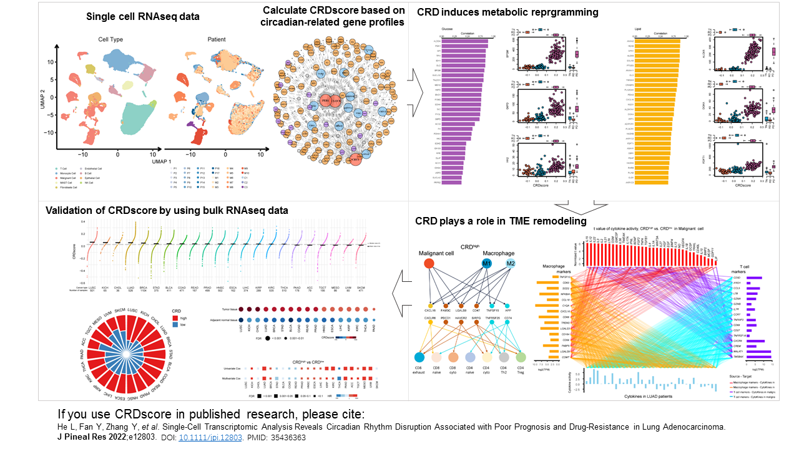

# CRDscore

### 1. Introduction
Circadian rhythm disruption (CRD) represents a major contributor to tumor progression, it plays 
a pivotal role in metabolic reprogramming and T cell exhaustion. 
The goal of CRDscore is to provide a novel computational framework for characterizing CRD status 
using single-cell or bulk transcriptome data. 



### 2. Installation
```{r}
if (!require("devtools")) 
    install.packages("devtools")
devtools::install_github("yixianfan/CRDscore")
```

### 3.Usage and example
```{r}
library(CRDscore)
data("exprset")
data("circadians_selected")

dim(exprset); head(exprset[,1:5])
head(circadians_selected); length(circadians_selected)

CRDscore <- cal_CRDscore(expr = exprset, n.bins = 50, circadians = circadians_selected, study.type = "scRNAseq")
head(CRDscore)

# graphic
library(tidyverse)

names(CRDscore) %>% 
  str_match(".*?_(.*?)_.*") %>% 
  as.data.frame() %>%
  rename(sample_id = V1, gr = V2) %>% 
  mutate(CRDscore = CRDscore) %>% 
  ggplot(aes(x = gr, y = CRDscore, color = gr)) +
  geom_boxplot()
 
```
